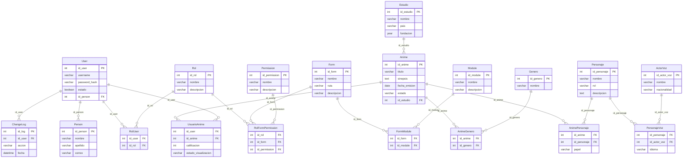

## Diagrama entidad-relación (ERD)



## Esquema de base de datos (DBML)

A continuación está el esquema proporcionado (formato DBML):

```dbml
Table Person {
	 # Esquema de base de datos (DBML)

	A continuación está el esquema proporcionado (formato DBML):

	```dbml
	Table Person {
	  id_person int [pk]
	  nombre varchar
	  apellido varchar
	  correo varchar
	}

	Table User {
	  id_user int [pk]
	  username varchar
	  password_hash varchar
	 # Esquema de base de datos (DBML)

	A continuación está el esquema proporcionado (formato DBML):

	```dbml
	Table Person {
	  id_person int [pk]
	  nombre varchar
	  apellido varchar
	  correo varchar
	}

	Table User {
	  id_user int [pk]
	  username varchar
	  password_hash varchar
	  estado boolean
	  id_person int [ref: > Person.id_person]
	}

	Table Rol {
	  id_rol int [pk]
	  nombre varchar
	  descripcion varchar
	}

	Table RolUser {
	  id_user int [ref: > User.id_user]
	  id_rol int [ref: > Rol.id_rol]
	  primary key (id_user, id_rol)
	}

	Table Permission {
	  id_permission int [pk]
	  nombre varchar
	  descripcion varchar
	}

	Table Module {
	  id_module int [pk]
	  nombre varchar
	  descripcion varchar
	}

	Table Form {
	  id_form int [pk]
	  nombre varchar
	  ruta varchar
	  descripcion varchar
	}

	Table FormModule {
	  id_form int [ref: > Form.id_form]
	  id_module int [ref: > Module.id_module]
	  primary key (id_form, id_module)
	}

	Table RolFormPermission {
	  id_rol int [ref: > Rol.id_rol]
	  id_form int [ref: > Form.id_form]
	  id_permission int [ref: > Permission.id_permission]
	  primary key (id_rol, id_form, id_permission)
	}

	Table ChangeLog {
	  id_log int [pk]
	  id_user int [ref: > User.id_user]
	  accion varchar
	  fecha datetime
	}

	Table Estudio {
	  id_estudio int [pk]
	  nombre varchar
	  pais varchar
	  fundacion year
	}

	Table Anime {
	  id_anime int [pk]
	  titulo varchar
	  sinopsis text
	  fecha_emision date
	  estado varchar
	  id_estudio int [ref: > Estudio.id_estudio]
	}

	Table Genero {
	  id_genero int [pk]
	  nombre varchar
	}

	Table AnimeGenero {
	  id_anime int [ref: > Anime.id_anime]
	  id_genero int [ref: > Genero.id_genero]
	  primary key (id_anime, id_genero)
	}

	Table Personaje {
	  id_personaje int [pk]
	  nombre varchar
	  rol varchar
	  descripcion text
	}

	Table AnimePersonaje {
	  id_anime int [ref: > Anime.id_anime]
	  id_personaje int [ref: > Personaje.id_personaje]
	  papel varchar
	  primary key (id_anime, id_personaje)
	}

	Table ActorVoz {
	  id_actor_voz int [pk]
	  nombre varchar
	  nacionalidad varchar
	}

	Table PersonajeVoz {
	  id_personaje int [ref: > Personaje.id_personaje]
	  id_actor_voz int [ref: > ActorVoz.id_actor_voz]
	  idioma varchar
	  primary key (id_personaje, id_actor_voz)
	}

	Table UsuarioAnime {
	  id_user int [ref: > User.id_user]
	  id_anime int [ref: > Anime.id_anime]
	  calificacion int
	  estado_visualizacion varchar
	  primary key (id_user, id_anime)
	}
	```

