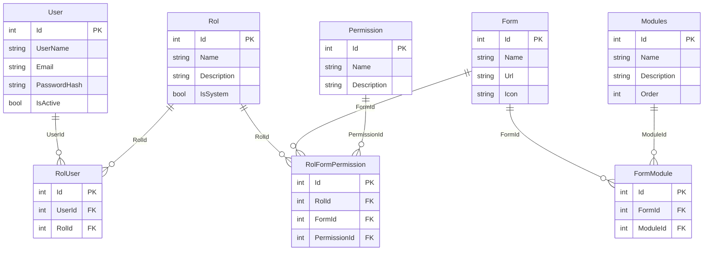
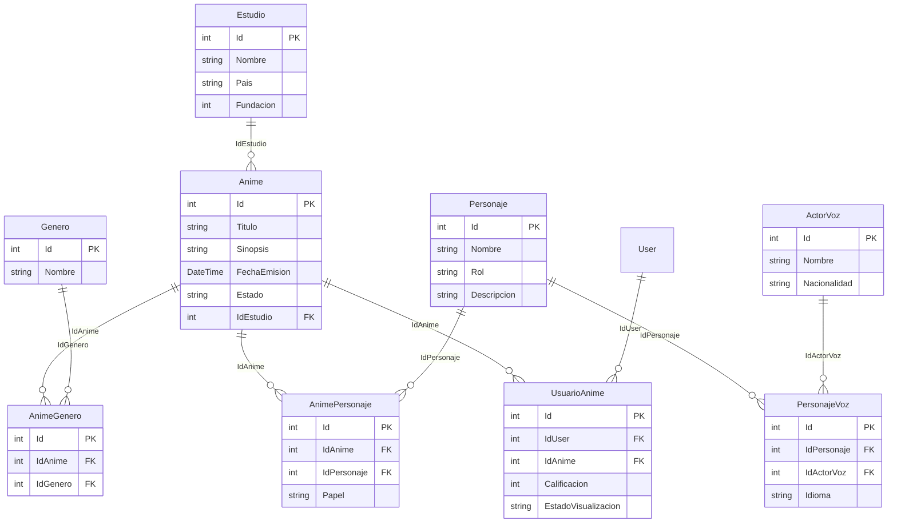

## Diagrama entidad-relación (ERD)

### Seguridad

```mermaid

erDiagram
    User {
        int Id PK
        string UserName
        string Email
        string PasswordHash
        bool IsActive
    }
    Rol {
        int Id PK
        string Name
        string Description
        bool IsSystem
    }
    RolUser {
        int Id PK
        int UserId FK
        int RolId FK
    }
    Permission {
        int Id PK
        string Name
        string Description
    }
    Modules {
        int Id PK
        string Name
        string Description
        int Order
    }
    Form {
        int Id PK
        string Name
        string Url
        string Icon
    }
    FormModule {
        int Id PK
        int FormId FK
        int ModuleId FK
    }
    RolFormPermission {
        int Id PK
        int RolId FK
        int FormId FK
        int PermissionId FK
    }

    User ||--o{ RolUser : "UserId"
    Rol ||--o{ RolUser : "RolId"
    Rol ||--o{ RolFormPermission : "RolId"
    Form ||--o{ FormModule : "FormId"
    Modules ||--o{ FormModule : "ModuleId"
    Form ||--o{ RolFormPermission : "FormId"
    Permission ||--o{ RolFormPermission : "PermissionId"
```

### Anime

```mermaid

erDiagram
    Estudio {
        int Id PK
        string Nombre
        string Pais
        int Fundacion
    }
    Anime {
        int Id PK
        string Titulo
        string Sinopsis
        DateTime FechaEmision
        string Estado
        int IdEstudio FK
    }
    Genero {
        int Id PK
        string Nombre
    }
    AnimeGenero {
        int Id PK
        int IdAnime FK
        int IdGenero FK
    }
    Personaje {
        int Id PK
        string Nombre
        string Rol
        string Descripcion
    }
    AnimePersonaje {
        int Id PK
        int IdAnime FK
        int IdPersonaje FK
        string Papel
    }
    ActorVoz {
        int Id PK
        string Nombre
        string Nacionalidad
    }
    PersonajeVoz {
        int Id PK
        int IdPersonaje FK
        int IdActorVoz FK
        string Idioma
    }
    UsuarioAnime {
        int Id PK
        int IdUser FK
        int IdAnime FK
        int Calificacion
        string EstadoVisualizacion
    }

    Estudio ||--o{ Anime : "IdEstudio"
    Anime ||--o{ AnimeGenero : "IdAnime"
    Genero ||--o{ AnimeGenero : "IdGenero"
    Anime ||--o{ AnimePersonaje : "IdAnime"
    Personaje ||--o{ AnimePersonaje : "IdPersonaje"
    Personaje ||--o{ PersonajeVoz : "IdPersonaje"
    ActorVoz ||--o{ PersonajeVoz : "IdActorVoz"
    Anime ||--o{ UsuarioAnime : "IdAnime"
    User ||--o{ UsuarioAnime : "IdUser"
```
